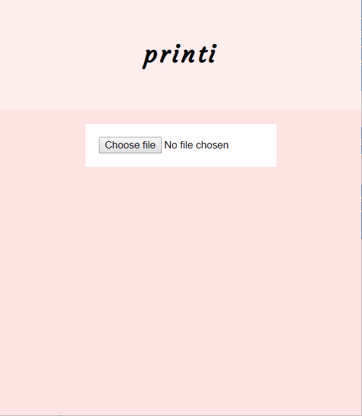
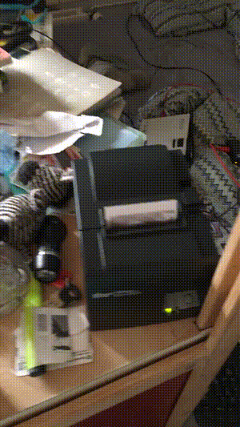

# printi
Visit [printi.me](https://printi.me/)!

_Use a thermal receipt printer to quickly print from your camera or photo library!_






The printi project consists of:
- 🖨 the _printi mini_, a thermal printer that connects to your wifi network, and
- 🌐 the _[printi.me](https://printi.me/)_ website, allowing anyone to quickly send pictures to your _printi mini_.

Images sent to printi.me are printed _within a second_ after uploading, making it the **fastest way to print a photo from anyone's smart phone or computer** (i think).

Want to build your own printi mini? Check out the [printi-client-esp32](https://github.com/fonsp/printi-client-esp32) repo!

Read more about the project on [the Github wiki](https://github.com/fonsp/printi/wiki). Contact us for any questions! ([Fons](https://github.com/fonsp) or [Leon](https://github.com/leonhandreke))

## Developing

```bash
# Start a postgres
docker compose up -d postgres
# Start the printi server
npm install && npm run dev
```
